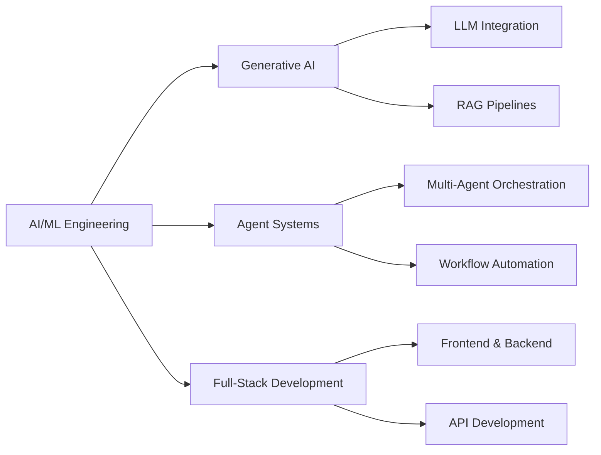

<div align="center">
  
# 👋 Hi, I'm Dev Nebula

### AI/ML Engineer | Generative AI Specialist | Full-Stack Developer

[](https://github.com/DevNebula300)
[](https://www.google.com/maps/place/Lahore)

</div>

---

## 🚀 About Me

I'm an **AI/ML Engineer** with strong expertise in **Generative AI** and **agentic systems**, focused on building intelligent, scalable, and production-ready applications. I specialize in integrating large language models into real-world products, designing automated workflows, and developing agent-driven systems that reduce manual effort and improve decision-making.

Backed by a solid full-stack engineering foundation, I deliver end-to-end AI-enabled solutions across frontend, backend, and APIs. My experience includes LLM prompt engineering, AI API integration, data-driven feature development, and system optimization.

💡 **Passionate about** taking AI solutions from experimentation to deployment while creating measurable business value.

---

## 🎯 What I Do



- 🤖 Building **production-ready AI applications** with LLMs
- 🔄 Designing **automated workflows** and **agent-driven systems**
- 🏗️ Developing **end-to-end solutions** from concept to deployment
- 📊 Creating **data-driven features** with measurable business impact
- 🎤 Building **chatbots** and **voicebots** with real-time processing
- ☁️ Deploying scalable solutions on **AWS, Azure, and GCP**

---

## 🛠️ Technical Arsenal

### 🤖 AI/ML & Generative AI

<details open>
<summary><b>Core AI/ML</b></summary>
<br>


**Specialized**: XGBoost, LoRA, QLoRA, PEFT, BitsandBytes, Accelerate, YOLO

</details>

<details open>
<summary><b>Generative AI & LLMs</b></summary>
<br>


**Tools & Frameworks**:
- 🦜 LangChain, LangGraph, LlamaIndex
- 🔗 OpenAI API, Anthropic Claude API
- 🎯 RAG Pipelines, MCP Servers
- 🤝 Multi-Agent Orchestration
- 📝 spaCy, NLTK, Flair
- 🔍 Named Entity Recognition, Text Classification, Semantic Search

</details>

<details>
<summary><b>Conversational AI</b></summary>
<br>

**Voice & Chat Technologies**:
- 🎤 Whisper, Azure Cognitive Services
- 🔊 AWS Polly, AWS Transcribe
- 📞 Twilio, VoIP Integration
- 💬 Real-time Speech-to-Text & Text-to-Speech
- 🗣️ Conversational AI Systems

</details>

### 💻 Full-Stack Development

<details>
<summary><b>Frontend</b></summary>
<br>


</details>

<details>
<summary><b>Backend</b></summary>
<br>


**APIs**: REST APIs, GraphQL, WebSockets, Microservices Architecture

</details>

### 📊 Data Engineering

<details>
<summary><b>ETL & Processing</b></summary>
<br>


**Capabilities**: PySpark, Dask, Data Pipelines, Feature Engineering, Data Warehousing, Data Lakes

</details>

### 🗄️ Databases & Vector Stores


**Vector Databases**: ChromaDB, Pinecone, Qdrant, Weaviate, FAISS  
**SQL Databases**: MySQL, SQLite, Oracle, MS SQL

### ☁️ Cloud & DevOps

<details>
<summary><b>Cloud Platforms</b></summary>
<br>


**AWS**: SageMaker, Lambda, EC2, S3, EMR, Comprehend  
**Azure**: ML Studio, Azure OpenAI, Databricks, Cognitive Services  
**GCP**: Vertex AI, BigQuery, GKE

</details>

<details>
<summary><b>MLOps & DevOps</b></summary>
<br>


**Tools**: Helm, CI/CD Pipelines, Prometheus, Grafana, MLflow, Model Monitoring

</details>

### 💼 Business & Pre-Sales

- 📋 Technical Proposals & Solution Architecture
- 🎤 Stakeholder Presentations & Client Discovery
- 📊 ROI Analysis & Proof of Concept Development
- 🤝 Requirements Gathering & Non-Technical Communication

---

## 📈 GitHub Stats

<div align="center">


</div>

---

## 🏆 GitHub Trophies

<div align="center">


</div>

---

## 📊 Contribution Graph


---

## 🔥 Current Focus

```python
class DevNebula:
    def __init__(self):
        self.role = "AI/ML Engineer"
        self.specialization = ["Generative AI", "Agent Systems", "Full-Stack Development"]
        self.currently_working_on = [
            "Building production-ready AI applications",
            "Multi-agent orchestration systems",
            "RAG pipeline optimization",
            "LLM fine-tuning and deployment"
        ]
        self.learning = [
            "Advanced prompt engineering techniques",
            "Distributed ML systems",
            "MLOps best practices"
        ]
        self.goals_2026 = [
            "Contribute to open-source AI projects",
            "Build impactful AI products",
            "Share knowledge through technical writing"
        ]
    
    def say_hi(self):
        print("Let's build something amazing together!")

me = DevNebula()
me.say_hi()
```

---

<div align="center">

### 💭 Random Dev Quote


### 🎵 Coding Vibe

"Building the future, one commit at a time 🚀"

---


**⭐ From [DevNebula300](https://github.com/DevNebula300) - Feel free to star my repos if you find them interesting!**

</div>
